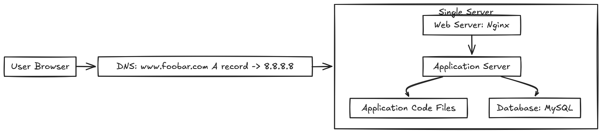
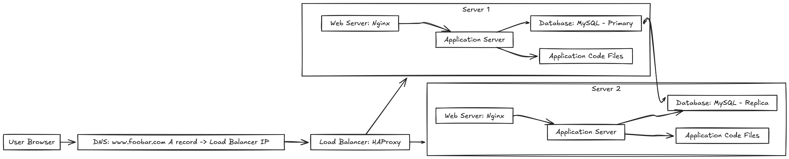
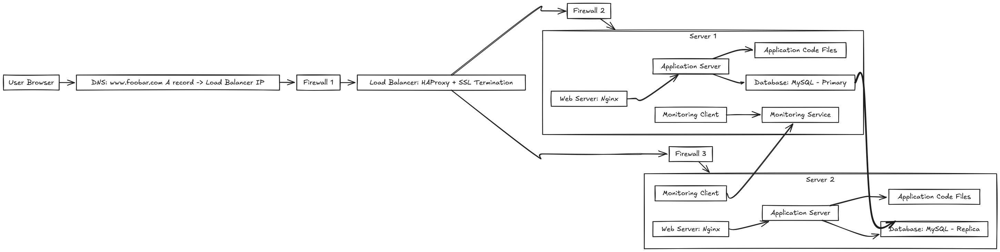
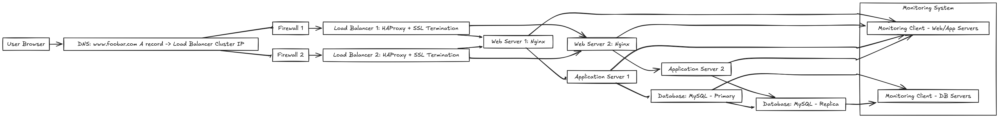

# Web Infrastructure Design

This project illustrates the progression from a simple single-server web setup to a scaled, secured, and monitored architecture.  
Each task contains:
- A diagram
- Component descriptions
- Issues and possible improvements

---

## Task 0 – Simple Web Stack

**Description**
- **User Browser** – Sends HTTP/HTTPS requests to the domain.
- **DNS** – Resolves `www.foobar.com` to the public IP `8.8.8.8`.
- **Web Server (Nginx)** – Serves static files (HTML, CSS, JS) and forwards dynamic requests to the application server.
- **Application Server** – Processes business logic using the application code.
- **Database (MySQL)** – Stores persistent data (users, content, transactions).

**Issues**
- **Single Point of Failure (SPOF)** – If the server fails, the entire site goes down.
- No load balancing or redundancy.
- Downtime required during maintenance.
- Limited ability to handle high traffic spikes.

**Possible Improvements**
- Introduce load balancing and multiple servers.
- Split database into primary and replica for redundancy.

---

## Task 1 – Distributed Web Infrastructure

**Description**
- **DNS** – Points to the load balancer’s IP.
- **Load Balancer (HAProxy)** – Distributes traffic between multiple web servers (round robin, least connections, etc.).
- **Web Servers (Nginx)** – Serve static content and forward dynamic requests to respective application servers.
- **Application Servers** – Run application logic.
- **Database – Primary (MySQL)** – Handles write operations.
- **Database – Replica (MySQL)** – Handles read queries; synced from primary.

**Issues**
- SPOF remains at the **Primary Database**.
- No firewall to protect network layers.
- No monitoring for performance or uptime.

**Possible Improvements**
- Add firewall layers.
- Introduce monitoring and alert systems.
- Implement automated failover for databases.

---

## Task 2 – Secured & Monitored Web Infrastructure

**Description**
- **Firewall Layers** – Restrict access between public users, web servers, and databases.
- **SSL Termination at Load Balancer** – Ensures HTTPS connections are secure.
- **Load Balancer** – Distributes requests to multiple servers.
- **Web Servers & App Servers** – Separated for better resource usage and scaling.
- **Primary & Replica Databases** – Write and read separation for improved performance.
- **Monitoring System** – Collects logs, metrics, and QPS (queries per second) from web, app, and DB servers.

**Issues**
- SPOF still at the Primary DB.
- No automatic DB failover.

**Possible Improvements**
- Introduce DB clustering or multi-master setup.
- Add CDN for faster global delivery.

---

## Task 3 – Scale Up

**Description**
- **DNS** – Balances between multiple load balancers (Active-Active setup).
- **Multiple Load Balancers** – Increase fault tolerance at the load balancing layer.
- **Multiple Web & App Servers** – Horizontally scaled for traffic spikes.
- **Primary & Replica Databases** – Same as before but still a SPOF at Primary.
- **Monitoring** – Covers all layers for performance and uptime metrics.

**Issues**
- SPOF remains at Primary DB (write operations).
- Complexity increases — requires orchestration.

**Possible Improvements**
- Multi-primary database clusters.
- Automated scaling and failover systems.
- Distributed caching layer (e.g., Redis, Memcached).

---
